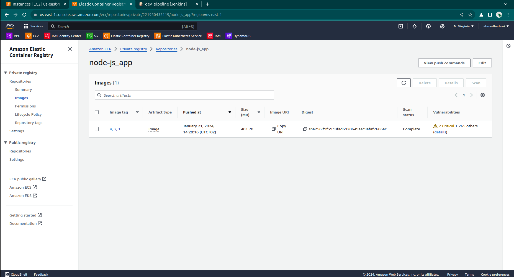
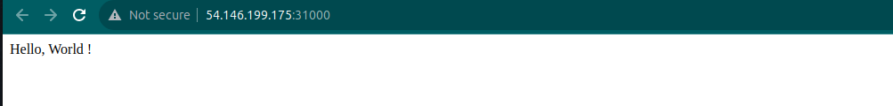

## Tools Used
 - AWS
 - Terraform
 - Ansible
 - Docker
 - Kubernates
 - Argo
 - Jenkins
 - Bash script
 - Helm

### Project Details:

 - Terraform scripts that build an environment on AWS content ( An EKS cluster with worker nodes in different availability zones and EC2 to install jenkins in it ) :
     - 1 VPC
     - 2 subnets
     - 1 IGW
     - 1 route table
     - 1 security group
     - 1 EC2
     - 2 worker nodes
     - 1 ECR
 - install jenkins on EC2 using ansible
 - access jenkins from > http://<public_ip for ec2>:8080
 - make ci/cd (dev_pipeline) with jenkins :
     - make unit testing on app
     - build a nodeJs app image and push it to ECR
     - Ensure that the Docker images are scanned for vulnerabilities
     - Deploy the app and mongoDB in Kubernetes 
     - access the application through the deployed on port 31000.
 - make ci/cd (argo_pipeline) with jenkins :
     - deploy argoCD in Kubernetes with Helm
     - apply application for nodeJs and mongoDB on Argo
     - Synced the app and database with gitlab repo


### Getting Started

- Clone The Code

```bash
  git clone https://gitlab.com/kashier1/node.js_app.git
```
- Setup your AWS account credentials

```bash
  aws configure
```
- Change the path and point it to AWS credentials files like this :


-----------------------------------------------------------------------------------------
### Build the Infrastructure

```bash
  cd terraform
```
```bash
  terraform init
```
- Output:


```bash
  terraform plan
```
```bash
  terraform apply
```
- Output:


- Copy the public IP from terrafom 

Now you can check your AWS account, you can see this resources has been created:
- 1 VPC named "vpc-main"
- 2 Subnets
- 1 Internet gateway
- 1 security group 
- 1 routing table
- 1 EC2
- Private Kubernetes cluster (EKS) with 2 worker nodes
- 1 ECR "node-js_app"


## Install Jenkins on EC2 with ansible :

- Run 

```bash
    cd ansible
```
- Put the public ip of EC2 in inventory file

- RUN

```bash
    ansible-playbook -i inventory install_jenkins.yml
```
- Output:


- Copy the output from ansible


-----------------------------------------------------------------------------------------

## configure Jenkins :

- You can access jenkins from browser >  http://<public_ip for ec2>:8080

- put the output from ansible in init password like this :

 

- install suggested plugins :

 

- create account in Jenkins :

 

- Now you can enter to jenkins :

 

- put your credentials ( you must use the same ID ) like this :

 


## Make dev_pipleline : 

- create your pipleline :

- configure your pipleline, put your url of repo and choose your github credentials :

 


## You can make webhook :
  - It's not working with me because i use free tier of gitlab , so i can't create access token 
  - but this is the steps :
    - create personal access token on gitlab from setting
    - create webhook on gitlab with url of jenkisn from setting
    - install gitlab plugin on jenkins
    - create credential (Gitlab API token)
    - in configuration pipleline enable "Build when a change is pushed to GitLab" and choose gitlab token

##  Steps of jenkinsfile for dev_pipeline :
- make unit testing on app
- build a nodeJs app image and push it to ECR
- Ensure that the Docker images are scanned for vulnerabilities
- Deploy the app and mongoDB in Kubernetes 


##  Build your pipleline :
 


## You can find all images you build it in ECR :

  

## That will deploy on EKS in namespace (dev) :

- Enter your AWS credentials

```bash
    aws configure
```

- connect to cluster

```bash
    aws eks --region us-east-1 update-kubeconfig --name cluster
```
- Run 

```bash
    kubectl get all -n dev
```
## Now you can show all resources of cluster

- mongoDB statefulset and Exopse it with ClusterIP service
- PV and PVC as storge for database
- nodeJs App Deployment and Exopse it with NodePort service
- Output:


## Make argo_pipleline :

- create your pipleline :

- configure your pipleline, put your url of repo and choose your gitlab credentials :

 

## Steps of jenkinsfile for argo_pipeline :

- Creat namespace (argo)
- deploy argoCD on namespace argo on EKS
- get your password and username to can access argoCD from browser
- deploy applications to make Synce between manifests files in GitLab and the deployed on EKS


## Build your pipleline :

 


## That will deploy on EKS in namespace (argo) :

```bash
    kubectl get all -n argo
```
```bash
    kubectl get application -n argo
```
- Output:


## The app now Synced with argo :

- Output:


## Now you can access your app from any worker node  :

- like this : http://<"ip of any worker node">:31000   

- Output:


